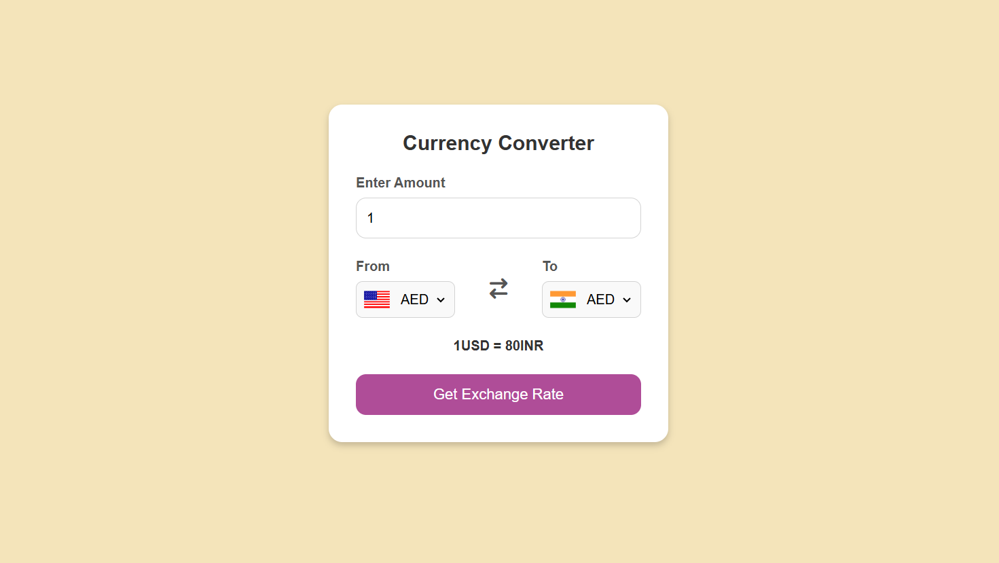

# 💱 Currency Converter

A simple web-based currency converter that fetches real-time exchange rates using an API.

## 🚀 Features

- Convert between multiple international currencies
- Live exchange rates via API
- User-friendly interface
- Responsive design

## 📷 Screenshot

## 🔧 Tech Stack

- HTML
- CSS
- JavaScript (Fetch API)

## 📁 Folder Structure

